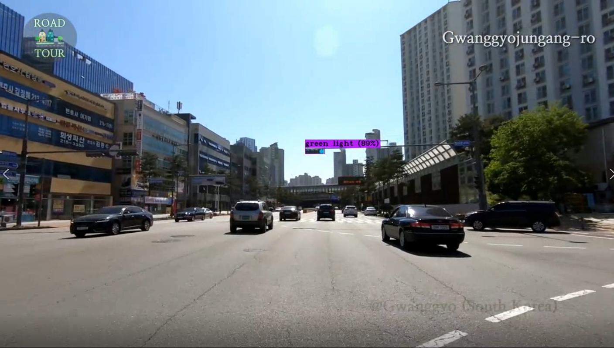
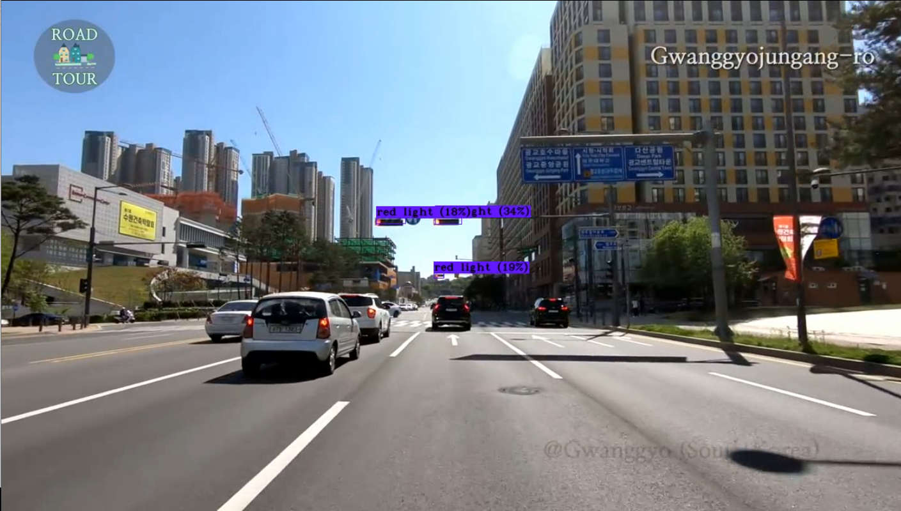
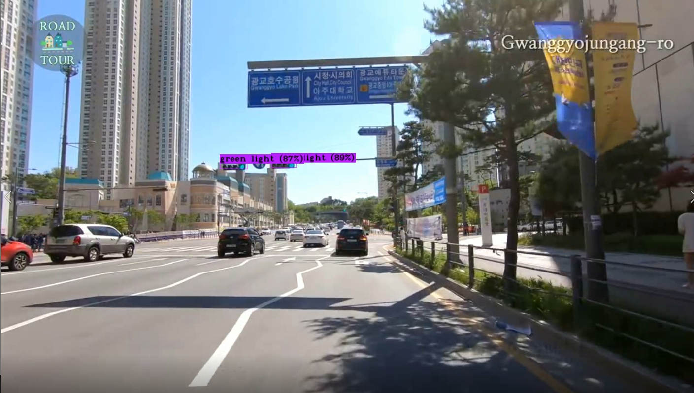
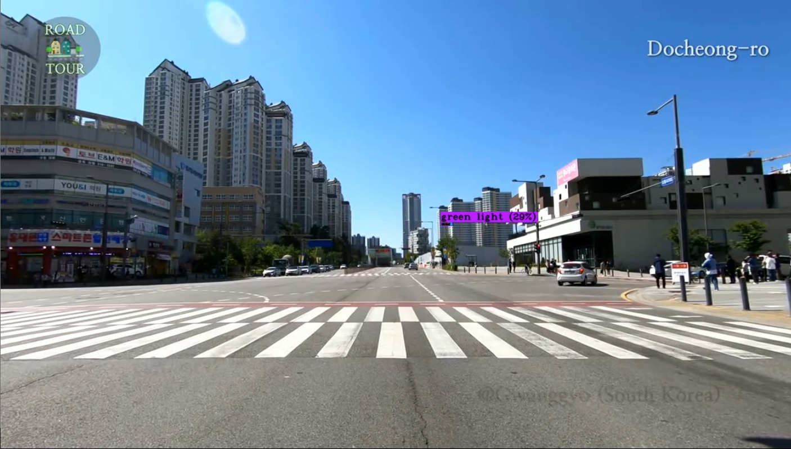
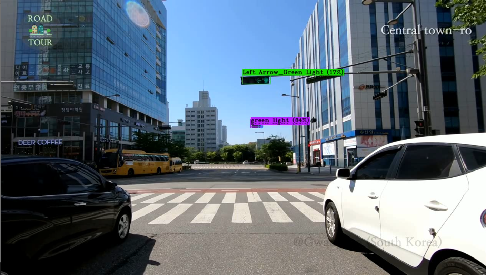
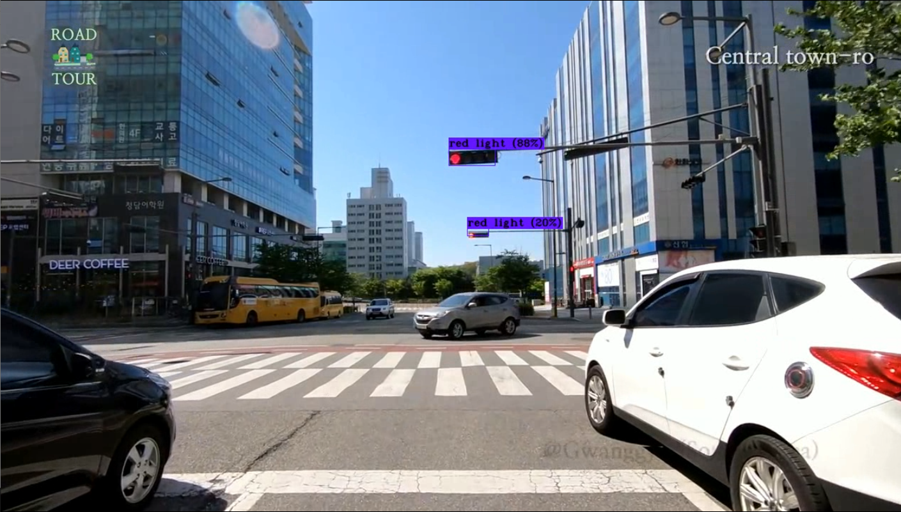
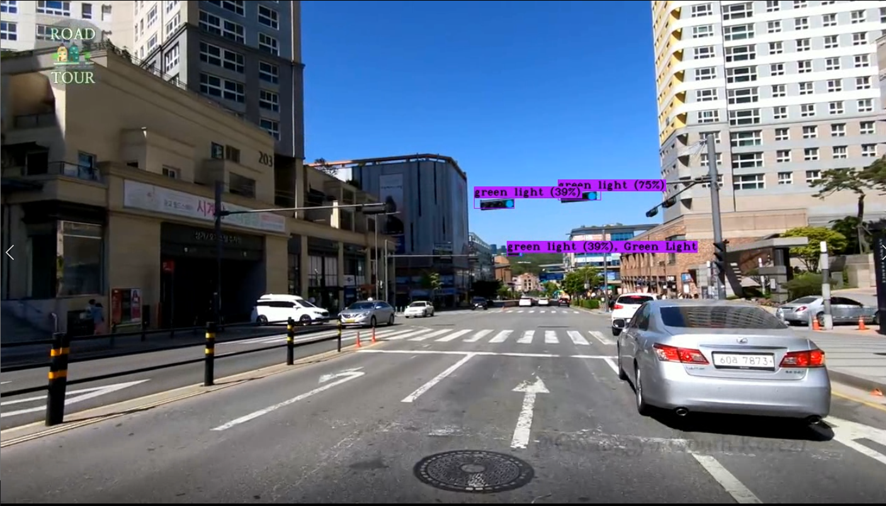
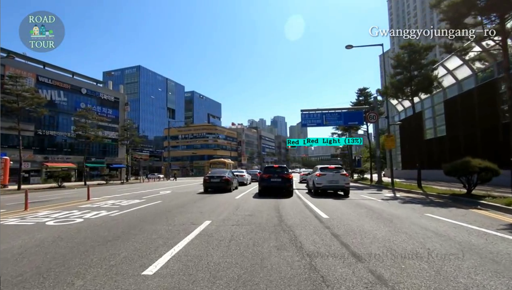

# Korean-Traffic-Light-Detection-by-using-Darknet-Frame-Work
### Traffic Light Dataset in South Korea (TL-Seoul) by ACE Lab
Download link https://en.acelab.org/traffic-light-dataset
### For detail information of intalling Darknet Framework please look out the video
https://www.youtube.com/watch?v=TP67icLSt1Y&t=969s
### Command for Finding anchors 
darknet.exe detector calc_anchors data/obj.data -num_of_clusters 9 -width 960 -height 960
### Command to train
darknet.exe detector train data/obj.data yolov3-tiny-modified.cfg yolov3-tiny.conv.15 
### Detection command in image
darknet.exe detector test data/obj.data yolov3-tiny-modified.cfg backup/yolov3-tiny-modified_152000.weights -thresh 0.1 -ext_output data/24.jpg
### Detection comand in video
darknet_no_gpu.exe detector demo data/obj.data yolov3-tiny-modified.cfg backup/yolov3-tiny-modified_4000.weights -thresh 0.1 DrivinginKorea.mp4 -out_filename DrivinginKorea.avi
### Out Put & rsults 

